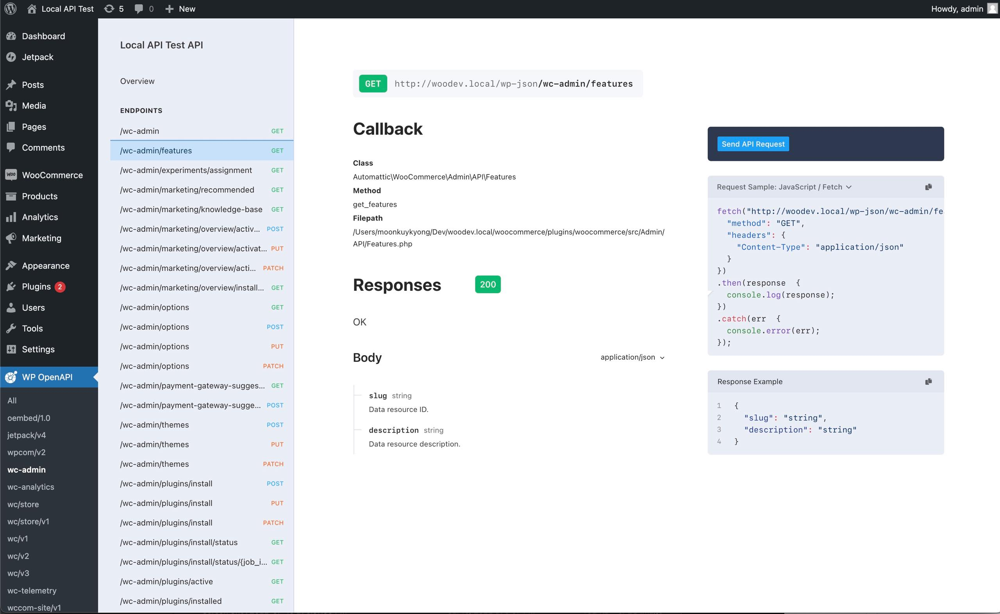
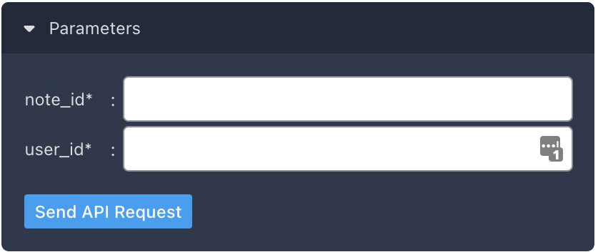
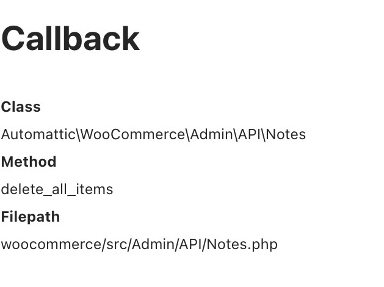

# WP OpenAPI

WP OpenAPI is a WordPress plugin that generates OpenAPI 3.1.0 compatible documentation for your WordPress REST APIs.

It has two main features.

1. Outputs OpenAPI 3.1.0 spec at `/wp-json-openapi`
2. Provides OpenAPI viewer using Stoplight's awesome [Elements](https://github.com/stoplightio/elements) viewer

## Screenshots



## Usage

1. Download the latest zip archive from [releases](https://github.com/moon0326/wp-openapi/releases) page and activate it.
2. You should see `WP OpenAPI` menu on the sidebar.
3. Click `All` to view all the endpoints or choose a namespace to view the endpoints registered in the namespace.

## Optional Settings

WP OpenAPI has two optional settings -- Enable Try It and Enable Callback Discovery.

Both settings are turned off by default.
You can enable them in `Settings -> WP OpenAPI`

**Enable Try It**: It enables [Elements](https://github.com/stoplightio/elements)'s TryIt feature. It lets you try the REST API endpoints.



**Enable Callback Discovery**: It shows you callback information about the endpoint you're viewing.
It comes in handy if you want to look at the source code of the endpoint.



## Extending

WP OpenAPI has the following filters to modify the output.

| Name                         |               Argument                | Equivalent Filters Method |
| ---------------------------- | :-----------------------------------: | ------------------------- |
| wp-openapi-filter-operation  | [Operation](./src/Spec/Operation.php) | AddOperationFilter        |
| wp-openapi-filter-path       |      [Path](./src/Spec/Path.php)      | AddPathFilter             |
| wp-openapi-filter-server     |    [Server](./src/Spec/Server.php)    | AddServerFilter           |
| wp-openapi-filter-info       |      [Info](./src/Spec/Info.php)      | AddInfoFilter             |
| wp-openapi-filter-tag        |       [Tag](./src/Spec/Tag.php        | AddTagFilter              |
| wp-openapi-filter-security   |                 Array                 | AddSecurityFilter         |
| wp-oepnapi-filter-components |                 Array                 | AddComponentsFilter       |

You can use individual filters by calling [add_filter](https://developer.wordpress.org/reference/functions/add_filter/).

You can also use [Filters](./src/Filters.php).

```php
Filters::getInstance()->AddPathFilter(function(Path $path, array $args) {
    if ($args['requestedNamespace'] === 'all') {
      foreach ($path->getOperations() as $operation) {
          $operation->setDescription("test description");
      }
    }
    return $path;
});
```

## Export

WP OpenAPI comes with a [WP CLI](https://wp-cli.org/) command to export a single HTML file.

You can use the file offline or host it on a webserver.

1. Install [WP CLI](https://wp-cli.org/)
2. Open a terminal session and cd to your WordPress installtion directory.
3. Run `wp openapi export --namespace=all --save_to=./export.html`

## Todo

- [ ] Code clean up
- [ ] Write tests
- [ ] Make a publicly accessible endpoint
- [ ] Remove this [dirty hack](https://github.com/moon0326/wp-openapi/blob/main/resources/scripts/wp-openapi.js#L12) :sweat_smile:
